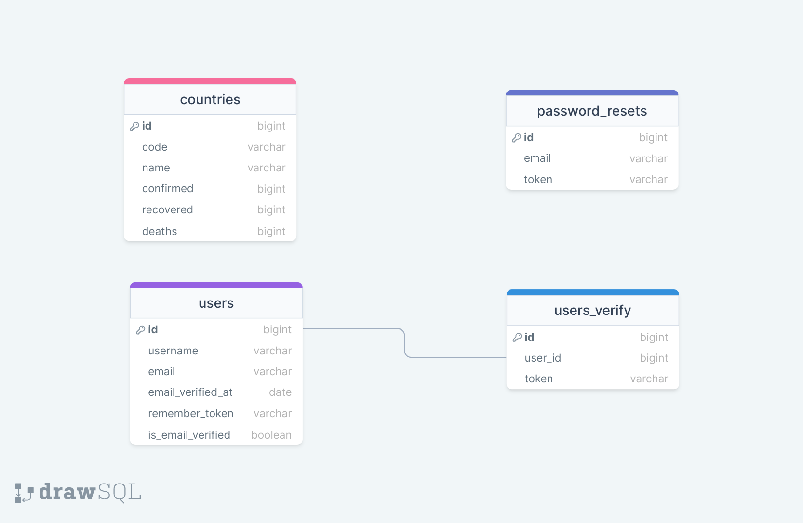

<div style="display:flex; align-items: center">
  <h1 style="position:relative; top: -6px" >Corona App</h1>
</div>

---
Coronatime - is a platform where we can register, go through authorization (as well as restore the password if we have forgotten it) and see what the situation is today in the countries of the world.

#
### Table of Contents
* [Prerequisites](#prerequisites)
* [Tech Stack](#tech-stack)
* [Getting Started](#getting-started)
* [Migrations](#migration)
* [Development](#development)

#
### Prerequisites

* *PHP@7.2 and up*
* *MYSQL@8 and up*
* *npm@6 and up*
* *composer@2 and up*


#
### Tech Stack

* [Laravel@6.x](https://laravel.com/docs/6.x) - back-end framework
*  [Spatie Translatable](https://github.com/spatie/laravel-translatable) - package for translation

#
### Getting Started
1\. First of all you need to clone repository from github:
```sh
git clone https://github.com/RedberryInternship/datomaluta-coronatime.git
```

2\. Next step requires you to run *composer install* in order to install all the dependencies.
```sh
composer install
```

3\. after you have installed all the PHP dependencies, it's time to install all the JS dependencies:
```sh
npm install
```

and also:
```sh
npm run dev
```

4\. Now we need to set our env file. Go to the root of your project and execute this command.
```sh
cp .env.example .env
```
And now you should provide **.env** file all the necessary environment variables:

#
**MYSQL:**
>DB_CONNECTION=mysql

>DB_HOST=127.0.0.1

>DB_PORT=3306

>DB_DATABASE=*****

>DB_USERNAME=*****

>DB_PASSWORD=*****


in order to cache environment variables.

4\. Now execute in the root of you project following:
```sh
  php artisan key:generate
```
Which generates auth key.

##### Now, you should be good to go!


#
### Migration
if you've completed getting started section, then migrating database if fairly simple process, just execute:
```sh
php artisan migrate
```

#
### Database Design Diagram


#
### Development

You can run Laravel's built-in development server by executing:

```sh
  php artisan serve
```

when working on JS you may run:

```sh
  npm run dev
```
it builds your js files into executable scripts.
If you want to watch files during development, execute instead:
